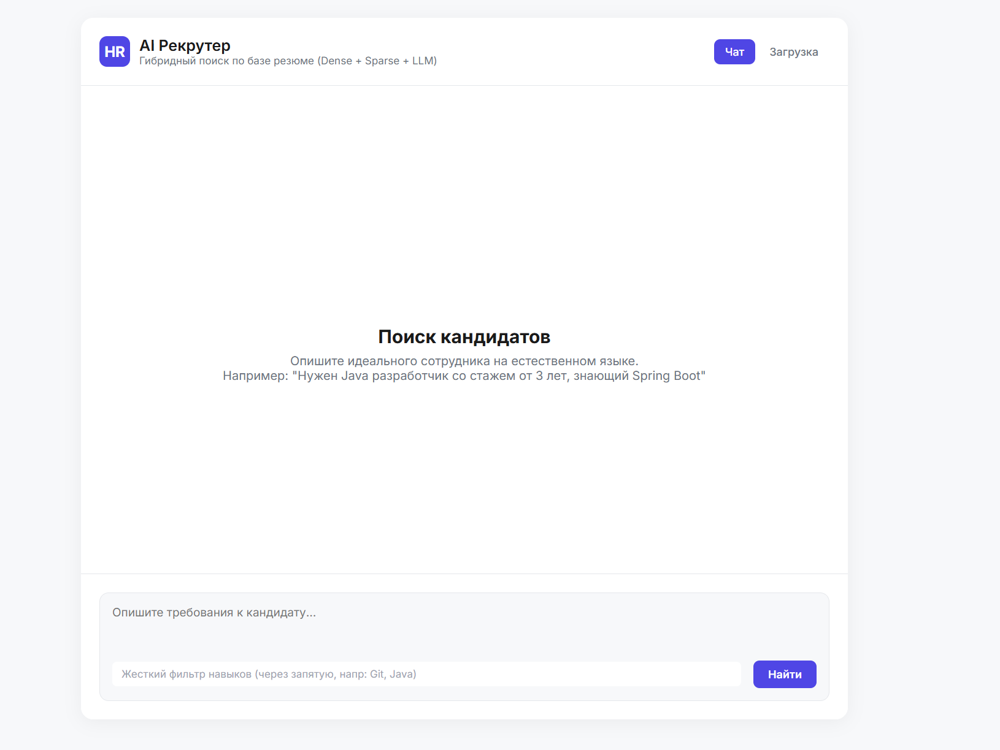
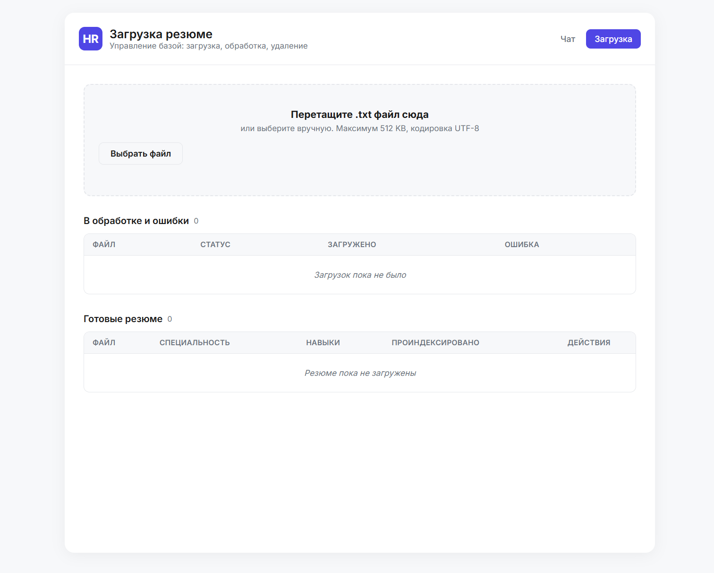
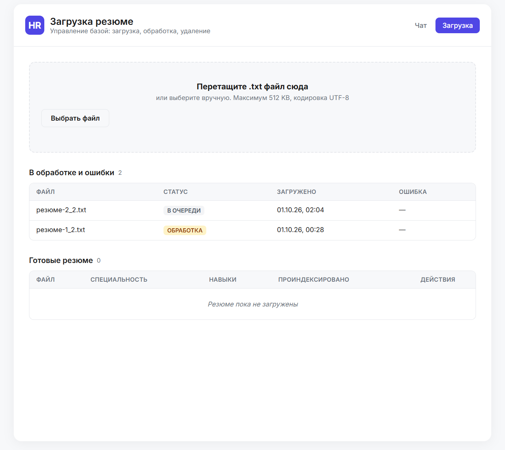
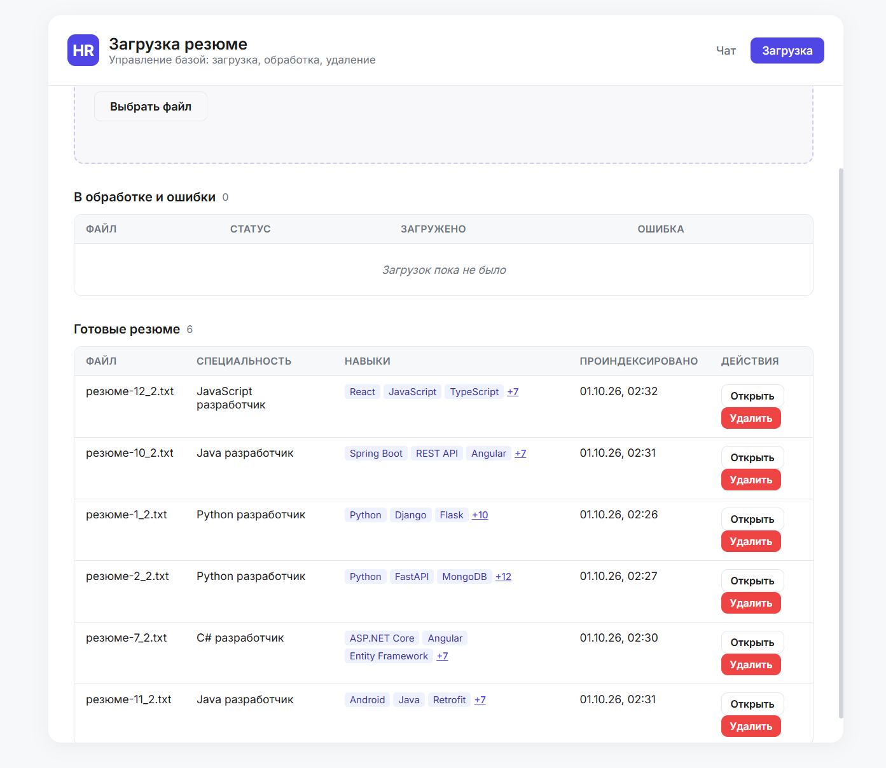
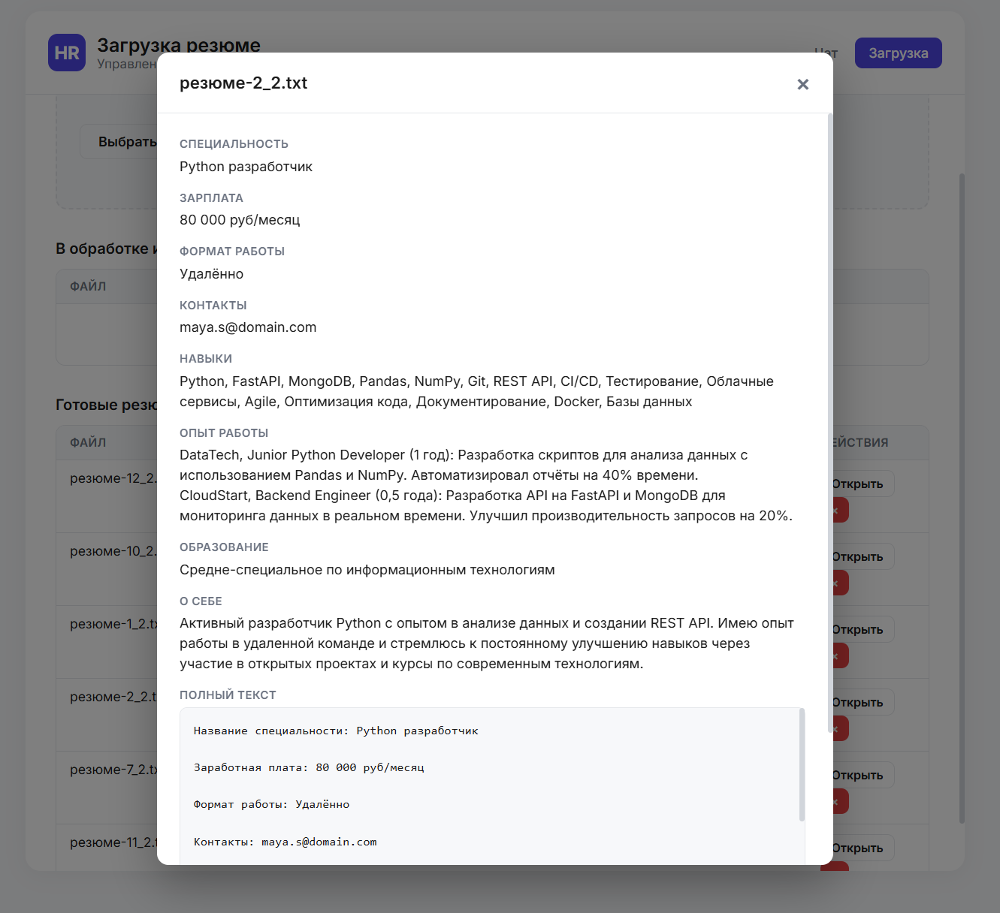
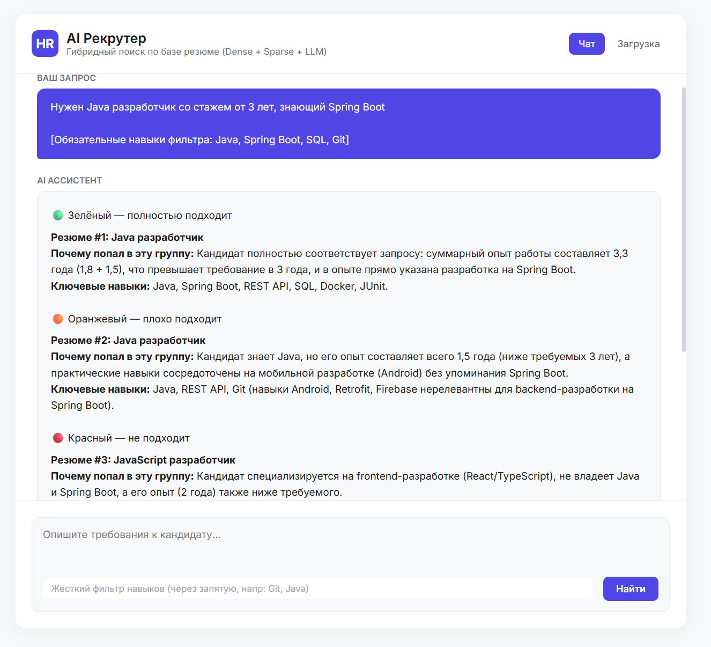
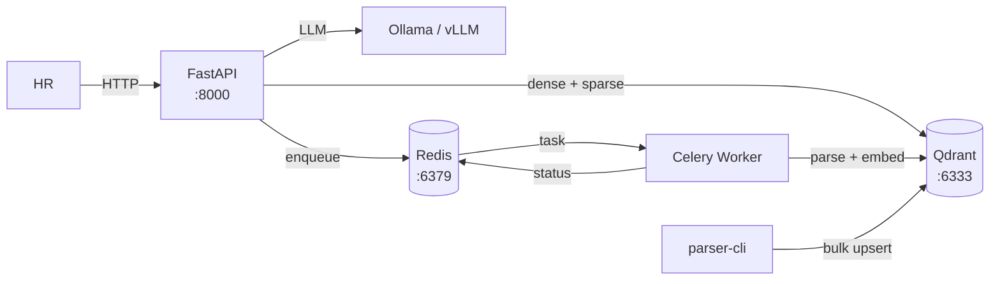

# AI Resume RAG System

[](https://python.org)
[](https://fastapi.tiangolo.com)
[](https://qdrant.tech)
[](https://redis.io)
[](https://docs.celeryq.dev)
[](https://docker.com)
[](#три-режима-llm-бэкенда)

Система семантического поиска и анализа резюме на базе RAG. Гибридный поиск (Dense BGE-M3 + Sparse BM25) в Qdrant, асинхронная обработка через Celery, локальная LLM (Ollama или vLLM) для генерации ответов. Всё работает в Docker, разворачивается одной командой.

## Скриншоты

<table>
  <tr>
    <td></td>
    <td></td>
  </tr>
  <tr>
    <td align="center"><b>Чат с AI-рекрутером</b></td>
    <td align="center"><b>Загрузка резюме</b></td>
  </tr>
  <tr>
    <td></td>
    <td></td>
  </tr>
  <tr>
    <td align="center"><b>Очередь и статусы в реальном времени</b></td>
    <td align="center"><b>Список готовых резюме</b></td>
  </tr>
  <tr>
    <td></td>
    <td></td>
  </tr>
  <tr>
    <td align="center"><b>Просмотр конкретного резюме</b></td>
    <td align="center"><b>Ответ LLM с цветовой категоризацией</b></td>
  </tr>
</table>

## Архитектура проекта



## Сервисы:

| Сервис | Роль | Профиль
|--|--|--
| `qdrant` | Векторная БД + BM25 (dense + sparse) | default
| `redis` | Broker Celery + хранилище статусов задач | default
| `api` | FastAPI: чат, загрузка, список, статусы | default
| `parser-worker` | Celery worker: парсинг → эмбеддинг → upsert | default
| `parser-cli` | Массовая переиндексация всех резюме | `manual`
| `ollama` | LLM в Docker (CPU-only, для CI) | `ollama-docker`
| `vllm` | LLM на GPU (production-профиль) | `vllm`

## Поток данных:

1. Парсинг — `parse_resume_txt()` разбирает `.txt` по шаблону, извлекает секции (специальность, опыт, навыки, образование).
2. Эмбеддинг — BGE-M3 кодирует полный текст резюме в dense-вектор (1024).
3. Индексация — точка с двумя векторами (dense + sparse BM25) и payload загружается в Qdrant.
4. Поиск — Universal Query API параллельно ищет по dense и sparse, объединяет результаты через RRF.
5. Генерация — топ-K резюме отправляются в LLM, которая категоризирует кандидатов по 4 цветам.
6. Асинхронность — долгие операции (парсинг + эмбеддинг ~2-5 сек) выполняются в Celery worker, UI получает статус через polling.

## Ключевые особенности

* **Hybrid Search** — объединение семантического поиска (BGE-M3 dense) и лексического BM25 (sparse-вектор генерируется сервером Qdrant из `full_text`, модель `qdrant/bm25`) через Reciprocal Rank Fusion. Находит синонимы, но при этом не пропускает точные названия технологий («Spring Boot», «CI/CD»).
* **Умное фильтрование** — извлечённые навыки хранятся как list в payload Qdrant с keyword-индексом, что позволяет делать точечные жёсткие фильтры до обращения к LLM.
* **Асинхронная обработка** — Celery + Redis. Загрузка файла возвращает `202 Accepted` мгновенно, парсинг идёт в фоне. UI видит прогресс через polling статусов.
* **Три режима LLM-бэкенда** — единый OpenAI-совместимый клиент работает с локальной Ollama, Ollama в Docker и vLLM. Переключение через переменные окружения.
* **Цветовая категоризация ответов LLM** — модель разделяет кандидатов на 4 группы (🟢 полностью подходит / 🟡 с нюансами / 🟠 плохо / 🔴 не подходит) с обоснованием.
* **Оптимизация Docker-образов** — модель эмбеддингов (~2.2 ГБ) скачивается на этапе `docker build`, а не при старте контейнера. Slim-образы, непривилегированные пользователи.
* **Fail-fast на старте** — API и worker проверяют доступность Redis и Qdrant при запуске и падают с понятной ошибкой, а не молча.

## Быстрый старт

### Требования
* Docker & Docker Compose
* Ollama, установленная на хосте (для режима по умолчанию)
* Скачанная модель: ollama pull qwen3.5:4b (или любая другая из вашего железа)

### 1. Подготовка данных

Поместите текстовые резюме в папку `resumes/` в корне проекта. Формат `.txt` должен соответствовать шаблону:
```
Название специальности: Python разработчик

Заработная плата: 65 000 руб/месяц

Формат работы: Гибрид

Контакты: alex.p@domain.com

Опыт работы:
...

Навыки:
Python (Продвинутый)
Django (Средний)
...

Образование: ...

О себе: ...
```

Обязательные секции: Название специальности, Опыт работы, Навыки. Остальное опционально.

### 2. Настройка

Скопируйте `.env.example` в `.env` и при необходимости поменяйте модель:
```bash
cp .env.example .env
# отредактируйте LLM_MODEL, если нужно
```

### 3. Запуск (режим по умолчанию — локальная Ollama)
```bash
docker compose up -d
```

Поднимутся `qdrant`, `redis`, `api`, `parser-worker`. Откройте http://localhost:8000

### 4. Индексация резюме

**Вариант A** — через UI: откройте http://localhost:8000/upload и перетащите файлы.

**Вариант B** — CLI для массовой переиндексации:
```bash
docker compose --profile manual up parser-cli
```

⚠️ **Внимание:** `parser-cli` делает **drop + recreate** коллекции Qdrant. Все текущие резюме удаляются и индексируются заново. Не запускайте его одновременно с загрузкой через UI — будет race condition.

## 5. Использование

Откройте http://localhost:8000 и опишите требования к кандидату:

> Нужен Python разработчик со знанием Django и опытом от 2 лет

При необходимости используйте поле жёсткого фильтра по навыкам: `Python, Django, Git`.

## Три режима LLM-бэкенда

Выбор режима — через переменные в `.env`:

| Режим | `.env` | Запуск
|--|--|--
| Локальная Ollama (дефолт) | `LLM_BACKEND_URL=http://host.docker.internal:11434/v1` | `docker compose up -d`
| Ollama в Docker | `LLM_BACKEND_URL=http://ollama:11434/v1` | `docker compose --profile ollama-docker up -d`
| vLLM (нужна GPU ≥ compute 7.0, ≥ 8GB VRAM) | `LLM_BACKEND_URL=http://vllm:8000/v1` `LLM_MODEL=Qwen/Qwen2.5-7B-Instruct-AWQ` | `docker compose --profile vllm up -d`


## API

| Метод | Путь | Назначение
|--|--|--
| `POST` | `/search` | RAG-поиск: retrieval + генерация ответа LLM
| `POST` | `/api/resumes/upload` | Загрузка `.txt` → `202 Accepted` + `task_id`
| `GET` | `/api/resumes` | Список готовых резюме
| `GET` | `/api/resumes/{id}` | Полное резюме по id
| `DELETE` | `/api/resumes/{id}` | Удаление резюме (Qdrant + файл + Redis)
| `GET` | `/api/tasks` | Статусы задач (queued / processing / failed)
| `GET` | `/health` | Healthcheck

### Пример `/search`:
```json
POST /search
{
  "query": "Нужен Python разработчик с Django и опытом 2+ года",
  "top_k": 5,
  "required_skills": ["Python", "Django"]
}
```

Ответ:
```json
{
  "answer": "### 🟢 Зелёный\n\n**Иван Иванов** — Python разработчик...",
  "found_resumes_count": 5
}
```

## Технические решения

### Почему BGE-M3, а не E5?

Изначально проект использовал `intfloat/multilingual-e5-large`. Проблема E5 — жёсткий лимит 512 токенов: всё, что длиннее, обрезается молча, а резюме с опытом легко превышают 512. Пришлось бы делать чанкинг с потерей контекста между секциями.

Перешли на **BAAI/bge-m3**:

| Критерий | E5-large | BGE-M3
|--|--|--
| Контекст | 512 токенов | 8192 токена
| Префиксы | `query:` / `passage:` обязательны | Не требуются
| Мультиязычность | 100+ языков | 100+ языков
| Размер модели | ~2294 МБ | ~2325 МБ |

8192 токена — это ~6000 слов, что с запасом покрывает резюме. Никакого чанкинга не нужно.

**Про sparse.** У BGE-M3 есть нативный sparse-выход (lexical weights), и теоретически его можно использовать как альтернативу BM25. В проекте он не задействован — по двум причинам:

Требует `FlagEmbedding` (отдельная библиотека) и ручной интеграции в `qdrant_client` — усложняет зависимости и код.

Qdrant имеет встроенную модель `qdrant/bm25`, которая генерирует sparse-вектор на стороне сервера без Python-зависимостей.

Миграция на нативный sparse BGE-M3 — потенциальное улучшение качества гибридного поиска (lexical weights обучены на парах «запрос-документ», тогда как BM25 — статистическая эвристика). Отмечено в Roadmap.

### Почему 1 резюме = 1 чанк?

Резюме — это связный документ, в котором опыт, навыки и образование дополняют друг друга. Нарезка на куски по 512 токенов (как было бы с E5) ломает эти связи: чанк с «опытом» теряет контекст «навыков», чанк с «навыками» — контекст «специальности».

BGE-M3 с контекстом 8192 токена позволяет индексировать резюме целиком. LLM получает полный текст, а не фрагмент, и даёт более осмысленные ответы.

### Что если резюме больше 8192 токенов?

Резюме длиннее 8192 токенов (~6000 слов) — это либо PDF-мусор, либо действительно гигантский документ. Обрабатываем явно:

1. На этапе API (`/api/resumes/upload`) — проверка размера файла: `> 512 KB` → `413 Payload Too Large`.
2. На этапе worker'а — точный подсчёт токенов через токенизатор модели: `> 8192` → задача помечается `failed` с текстом `«Резюме слишком большое: N токенов (лимит 8192)»`.
3. Пользователь видит ошибку в таблице «В обработке и ошибки» и может уменьшить резюме вручную.

> Альтернатива на будущее: автоматический чанкинг с overlap и полем `resume_id` в payload для группировки чанков одного резюме. Описано в Roadmap.

### Почему гибридный поиск (dense + sparse)?

Dense-поиск (эмбеддинги) ловит семантику: «Python-разработчик» найдёт «backend-инженер на питоне». Но он плохо различает точные термины: «CI/CD» и «CICD» — почти одинаковы для модели, а на самом деле одно — правильное, другое — опечатка.

Sparse BM25 ловит точные совпадения: «Django», «Spring Boot», «k8s» — уникальные термины, которые dense-модель может «размыть».

**RRF (Reciprocal Rank Fusion)** объединяет оба ранжирования: кандидат, попавший в топ обоих списков, поднимается выше, чем кандидат из топа только одного. Это даёт лучшее качество, чем любая из моделей по отдельности.

### Почему Qdrant Universal Query API, а не legacy?
В Qdrant 1.10+ появился Universal Query API: `query_points` с `prefetch` + `FusionQuery`. Он выполняет dense и sparse поиск параллельно на сервере и возвращает уже объединённый результат. Legacy-подход требовал двух отдельных запросов и ручного объединения на клиенте.

Sparse-вектор генерируется на сервере Qdrant через встроенную модель `qdrant/bm25` — никаких дополнительных Python-зависимостей (`fastembed` и т.п.).

### Почему OpenAI-совместимый API?
Ollama, vLLM и облачные провайдеры (OpenAI, Anthropic, Together) поддерживают OpenAI Chat Completions API. Используя официальный `openai` SDK, мы получаем:

* Один клиент для трёх бэкендов — переключение через `LLM_BACKEND_URL` в `.env`.
* Production-ready код — если завтра переезжаем на облако, меняем одну строку в конфиге.
* Стандартный интерфейс — `chat.completions.create(...)`, известный всем.

Отказались от Python-пакета `ollama`, потому что он использует нативный API Ollama (`/api/chat`) с параметрами типа `num_ctx`, несовместимыми с OpenAI-форматом. Теперь `num_ctx` задаётся через env `OLLAMA_CONTEXT_LENGTH` на стороне Ollama.

### Почему Celery + Redis?

Парсинг + эмбеддинг через BGE-M3 — 2-5 секунд на CPU. Если делать это синхронно в HTTP-запросе:
* UI будет висеть всё это время.
* При нагрузке пул воркеров uvicorn забьётся.
* При падении API незавершённые задачи потеряются.

Celery решает всё:
* Асинхронность — API возвращает `202 Accepted` мгновенно.
* Отказоустойчивость — `task_acks_late=True`, задачи не теряются при падении worker'а.
* Масштабируемость — можно запустить N воркеров (`--concurrency=N`), просто добавив контейнеры.
* Статусы из коробки — `PENDING` / `STARTED` / `SUCCESS` / `FAILURE`.

Redis используется как broker (очередь задач, DB 0) и backend (результаты, DB 1), плюс как хранилище статусов для UI (hash `resumes:tasks`, DB 0). Один сервис — три роли.

### Почему цветовая категоризация в промпте?

HR-специалист получает от LLM список из 5 резюме. Без категоризации приходится читать каждое и самому решать, кто релевантен. С цветами — сразу видно, кого смотреть первым.

Промпт явно описывает критерии каждой группы (все ключевые требования / мелкие пробелы / часть важных / не подходит), чтобы даже небольшая модель (qwen3.5:4b) давала консистентный результат. Emoji `🟢🟡🟠🔴` выводится в Markdown и рендерится в UI без правок на фронте.

## Структура проекта

```
.
├── api/                    # FastAPI-сервис
│   ├── Dockerfile
│   ├── requirements.txt
│   ├── main.py             # точка входа, startup
│   ├── celery_client.py    # клиент для отправки задач
│   ├── schemas.py          # Pydantic-схемы API
│   ├── routes/
│   │   ├── search.py       # POST /search
│   │   ├── resumes.py      # upload / list / get / delete
│   │   └── tasks.py        # GET /api/tasks
│   └── static/             # HTML + CSS
├── parser/                 # Celery worker + CLI
│   ├── Dockerfile
│   ├── requirements.txt
│   ├── celery_app.py       # инстанс Celery
│   ├── tasks.py            # задача index_resume
│   └── parser_and_index.py # CLI массовой переиндексации
├── common/                 # общий пакет (копируется в оба образа)
│   ├── models.py           # ResumePayload, TaskStatus
│   ├── parsing.py          # parse_resume_txt + валидация
│   ├── embeddings.py       # BGE-M3 singleton
│   ├── qdrant_ops.py       # операции с Qdrant
│   ├── redis_ops.py        # статусы задач
│   └── indexing.py         # оркестрация: parse → embed → upsert
├── resumes/                # .txt файлы резюме (bind-mount)
├── docker-compose.yml
├── .env.example
└── docs/screenshots/
```

## Known limitations

| Ограничение | Причина | План
|--|--|--
| Только `.txt` | Парсер работает по строгому шаблону | PDF/DOCX + OCR — см. Roadmap
| Нет retry в Celery | MVP: упавшая задача пишет `failed` | `autoretry_for` с backoff — см. Roadmap
| Sync-вызовы Redis в `async def` | Простота кода | `redis.asyncio` — см. Roadmap
| Нет пагинации `/api/resumes` | `limit=100` по умолчанию | `next_offset` через Qdrant scroll
| Race condition `parser-cli` vs `parser-worker` | CLI делает drop+recreate коллекции | Redis lock перед drop
| Качество qwen3.5:4b | Маленькая модель на слабом железе | Рекомендация: vLLM + 7B-AWQ
| `TaskStatus` в Redis растёт неограниченно | Не удаляем `indexed`-записи (аудит) | TTL или cleanup-job
| Имя файла в `onclick` через строку | Простая реализация UI | Event delegation
| Нет идемпотентности загрузки | `uuid4()` на каждый upload + `_resolve_collision` для имён | Дедуп по `hash(full_text)` или по содержимому файла

## Roadmap

- Eval-датасет + recall@k — golden dataset из 30-50 запросов с аннотированными релевантными чанками. Метрики: Recall@5, Recall@10, MRR.
- Формальные бенчмарки — TTFT, throughput, E2E latency на разных конфигурациях (Ollama CPU / vLLM GPU).
- PDF / DOCX — `pypdf` и `python-docx` + валидация на существующий шаблон.
- Реранкер — cross-encoder для топ-20 после hybrid search.
- Чанкинг для гигантских резюме — если > 8192 токенов, нарезать с overlap и хранить resume_id для группировки.
- Retry в Celery — `autoretry_for=(ConnectionError,)`, `max_retries=3`, `retry_backoff=True`.
- Async Redis — `redis.asyncio` + `await` в эндпоинтах.
- Streaming LLM-ответов — SSE или WebSocket для посимвольной выдачи.
- Authentication — Basic Auth или JWT для production-развёртывания.
- Нативный sparse BGE-M3 — заменить `qdrant/bm25` на lexical weights от BGE-M3 через `FlagEmbedding`. Потенциально лучше качество: модель обучена на парах «запрос-документ».
- Идемпотентная загрузка — вычислить SHA-256 от содержимого файла, использовать как `resume_id` (детерминированный). Повторная загрузка того же контента → upsert перезапишет точку вместо создания дубля.

## Лицензия

MIT
